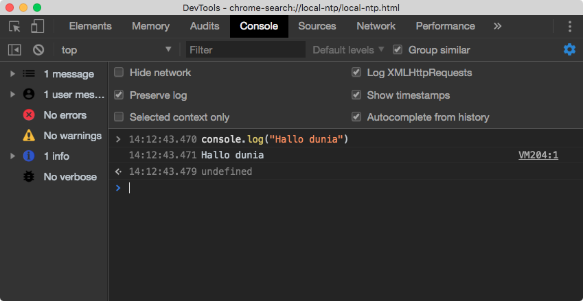

# Persiapan Lingkungan Pengembangan

## Prasyarat: Browser Modern
Karena versi javascript yang akan dipelajari adalah versi **ES6**, disarankan menggunakan Google Chrome, Mozilla Firefox, Opera, Edge maupun Safari. Dalam panduan ini akan digunakan Google Chrome.

## Pilihan A: Koding Lokal (Offline)
Disarankan menggunakan beberapa editor berikut.
- [Sublime Text](https://www.sublimetext.com/ "Unduh di sini."), gratis dan kode sumber terbuka. Anda akan mendapat _popup_ setelah beberapa kali menyimpan berkas, jika Anda menggunakan versi gratisnya.
- [Atom](https://atom.io/ "Unduh Atom di sini."), gratis dan kode sumber terbuka. Tidak ada versi berbayar.
- [Code](https://code.visualstudio.com/), gratis dan kode sumber terbuka. Tidak ada versi berbayar.

## Pilihan B: Koding Daring (Online)
Pilihan ini digunakan jika Anda malas melakukan konfigurasi di mesin anda. Sangat beruntung ekosistem javascript memiliki banyak perkakas yang memungkinkan untuk koding secara daring tentunya syaratnya anda harus Daring (Online).
- [Codepen](https://codepen.io/)
- [Codesandbox](https://codesandbox.io/)
- [Glitch](http://glitch.com/)
- [Repl.it](https://repl.it/)

### Menggunakan browser dev tools
Modern browser dilengkapi dengan dev tools untuk membantu proses pengembangan web. Setiap browser memiliki dev tools yang berbeda namun semuanya hampir sama.

Di dalam dev tools terdapat **Javascript console** (Untuk menulis perintah dan menampilkan output kode Javascript), **Page inspector** (untuk menampikan struktur halaman web).

