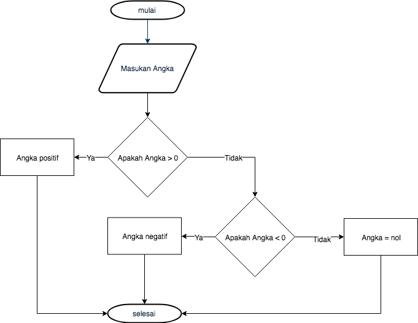

# Kondisi

# Rangkuman

* Kata kunci `if` mendefinisikan kondisional. Kode block yang ada didalam `if` hanya akan dijalankan jika kondisi memenuhi (mengembalikan nilai `true`).

```js
if (kondisi) {
    // Kode yang dijalankan jika kondisi mengembalikan nilai true
}
```

* Kode block didalam `if` di diapit dengan tanda kurung kurawal (`{...}`). Untuk mempermudah pembacaan kode block ditambahkan indentasi.

* Operator pembanding seperti `===`, `!==`, `<=`, `>=`, `>` dan `<` didalam kondisi semua operator tersebut mengembalikan nilai boolean.
 
* `if` dapat berisikan (opsional) statement `else` untuk menambahkan kode yang perlu dieksekusi jika kondisi mengembalikan nilai `false`

```js
if (kondisi) {
    // Kode yang dijalankan jika kondisi mengembalikan nilai true
} else {
    // Kode yang dijalankan jika kondisi mengembalikan nilai false
}
```

### Apa itu Kondisi ?

Bayangkan jika kita akan membuat program yang menerima sebuah input angka kemudian menampilkan pesan jika angka positif.

```
Masukan sebuah angka
Jika angka positif
    Tampilkan sebuah pesan
```

### Statement `if` 

Berikut adalah program diatas yang ditulis dalam Javascript.
```js
const number = Number(prompt("Masukan sebuah angka:"));
if (number > 0) {
    console.log(`${number} adalah positif`);
}
```

### Kondisi

Sebuah kondisi adalah ekspresi yang mengevaluasi sebuah nilai apakah bernilai `true` atau `false`, nilai ini disebuat Boolean. Jika kondisi mengembalikan nilai `true` maka kondisi tersebut terpenuhi.

Sebelumnya sudah kita pelajari tipedata String dan Number, Boolean ada tipedata yang lainnya.

```js
if (true) {
  // Kondisi ini selalu true
  // Kode block didalamnya akan selalu dieksekusi
}
if (false) {
  // Kondisi ini selalu false
  // Kode block didalamnya tidak akan pernah dieksekusi
}
```

Ekspresi yang mengembalikan nilai Boolean dapat dilakukan dengan operator berikut.

|Operator|Kegunaan|
|---------|----|
|`===`|Nilainya sama|
|`!==`|Nilainya tidak sama|
|`<`|Kurang dari|
|`<=`|Kurang dari sama dengan|
|`>`|Lebih dari|
|`>=`|Lebih dari sama dengan|

Sekarang coba untuk mengubah kode diatas menjadi seperti ini.
```js
const number = Number(prompt("Masukan sebuah angka:"));
if (number >= 0) {
    console.log(`${number} adalah positif atau nol`);
}
```

## Kondisi alternatif

### Statement `else`

Tambahkan kode diatas dengan statement `else`

```js
const number = Number(prompt("Masukan sebuah angka:"));
if (number > 0) {
    console.log(`${number} adalah positif atau nol`);
} else {
    console.log(`${number} adalah negatif atau nol`);
}
```

### Kondisi yang bersarang

```js
const number = Number(prompt("Masukan sebuah angka:"));
if (number > 0) {
  console.log(`${number} adalah positif`);
} else {
  // number <= 0
  if (number < 0) {
    console.log(`${number} adalah negatif`);
  } else {
    // number === 0
    console.log(`${number} adalah nol`);
  }
}
```

Kondisi bersarang diatas dapat digambarkan berupa flow diagram seperti dibawah.



## Menambahkan Logika tambahan

### Operator "And"

```js
if ((number >= 0) && (number <= 100)) {
  console.log(`${number} diantara 0 dan 100`);
}
```

### Operator "Or"

```js
if ((number < 0) || (number > 100)) {
  console.log(`${number} tidak diantara 0 dan 100`);
}
```

Dengan operator `||` salah satu nilai bernilai `true`, maka hasilnya akan `true`

```js
console.log(true || true);   // true
console.log(true || false);  // true
console.log(false || true);  // true
console.log(false || false); // false
```

### Operator "Not"

```js
if (!(number > 100)) {
  console.log(`${number} kurang dari atau sama dengan 100`);
}
```

Tabel kebenaran dari operator `!`.

```js
console.log(!true);  // false
console.log(!false); // true
```

## Kondisi yang beragam

Berikut contoh kode seseorang yang menentukan pakaian yang digunakan berdasarkan cuaca hari ini.

```js
const weather = prompt("Bagaimanakah cuaca hari ini ?");
if (weather === "cerah") {
  console.log("T-shirt!");
} else if (weather === "berangin") {
  console.log("Pakai jaket!");
} else if (weather === "hujan") {
  console.log("Bawa payung!");
} else {
  console.log("Cuaca tidak valid");
}
```

Alternatif kode diatas adalah menggunakan kata kunci `switch`

```js
const weather = prompt("Bagaimanakah cuaca hari ini ?");
switch (weather) {
  case "cerah":
    console.log("T-shirt!");
    break;
  case "berangin":
    console.log("Pakai jaket!");
    break;
  case "hujan":
    console.log("Bawa payung!");
    break;
  default:
    console.log("Cuaca tidak valid");
}
```

## Waktunya Koding!

### Hari esok

Tulislah sebuah program yang menerima input Hari ini dan mengeluarkan output nama hari esok.

### Membandingkan angka

Tulislah sebuah program yang menerima 2 input angka, dan mengeluarkan output hasil perbandingannya.

### Hasil akhir

Perhatikan kode dibawah.

```js
let nb1 = Number(prompt("Masukan nb1:"));
let nb2 = Number(prompt("Masukan nb2:"));
let nb3 = Number(prompt("Masukan nb3:"));

if (nb1 > nb2) {
  nb1 = nb3 * 2;
} else {
  nb1++;
  if (nb2 > nb3) {
    nb1 += nb3 * 3;
  } else {
    nb1 = 0;
    nb3 = nb3 * 2 + nb2;
  }
}
console.log(nb1, nb2, nb3);
```

Sebelum menjalankan kode diatas, cobalah untuk menebak nilai dari `nb1`, `nb2` dan `nb3` tergantung dari nilai awalnya.

|Initial values       |`nb1` final value |`nb2` final value|`nb3` final value|
|---------------------|------------------|-----------------|-----------------|
|`nb1=nb2=nb3=4`      |                  |                 |                 |
|`nb1=4,nb2=3,nb3=2`  |                  |                 |                 |
|`nb1=2,nb2=4,nb3=0`  |                  |                 |                 |

### Banyak hari dalam 1 bulan

Tulislah sebuah program yang menerima masukan berupa angka (1-12), kemudian menampilkan banyak hari dalam bulan tersebut. Masukan hasus divalidasi.

